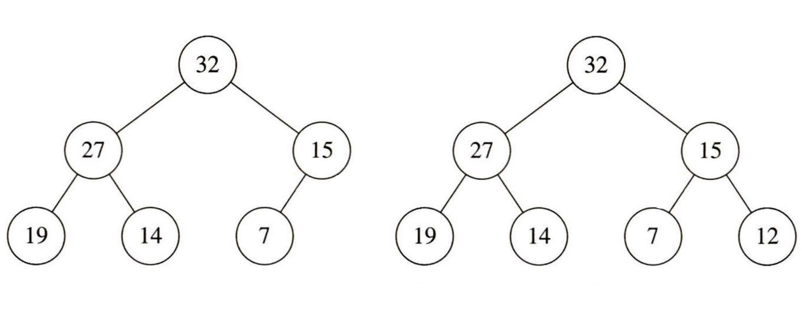

> 트리는 현실 세계의 계층적 구조를 표현하는 것 외에도 다양한 용도로 사용된다. 이 글은 그 중 잘 알려진 이진 검색 트리와 힙에 대해 설명한다.

## 이진 트리

**이진 트리**란 **각 노드가 왼쪽과 오른쪽, 최대 두 개의 자식 노드만을 가질 수 있는 트리**이다.

**v 예시**

## 이진 검색 트리

**검색 트리**는 자료들을 일정한 순서에 따라 정렬한 상태로 저장한다. 검색 트리는 이 점을 이용해 **원소의 추가와 삭제만이 아니라, 특정 원소의 존재 여부 확인 등의 다양한 연산을 빠르게 수행**한다. 검색 트리 중 가장 흔하게 사용되는 것이 바로 **이진 검색 트리(binary search tree)**이다.

이진 검색 트리의 각 노드는 하나의 원소(값)를 가지고 있다. **각 노드의 왼쪽 서브 트리에는 해당 노드의 원소보다 작은 원소를 가진 노드들이, 오른쪽 서브트리에는 보다 큰 원소를 가진 노드들이 들어간다**.

**v 예시**

이진 검색 트리는 이진 탐색에서 아이디어를 가져와서 만든 트리이다. 따라서 이진 검색 트리에서 원하는 값을 찾는 과정은 배열에서의 이진 탐색과 비슷하다. N개의 원소 중에서 원하는 값을 찾을 때 매번 후보의 수를 절반씩 줄여가 O(lgN) 시간에 그 값을 찾을 수 있어 효율적이다.

## 완전 이진 트리, 포화 이진 트리

**완전 이진 트리**는 마지막 레벨을 제외한 모든 레벨이 노드들로 완전히 채워져 있으며, 마지막 레벨의 노드들은 가장 왼쪽부터 순서대로 채워져 있는 트리이다. **포화 이진 트리**는 **마지막 레벨의 노드(리프)들을 제외한 모든 내부 노드가 두 개의 자식 노드를 가지는 이진 트리**이다.

**v 예시**

배열을 이용해 이들을 효율적으로 구현할 수 있다. 일차원 배열 A[]에 노드들을 순서대로 저장하면 다음과 같은 사실을 알 수 있다.

- A[i]에 대응되는 노드의 **왼쪽 자손은 A[2*i+1]**에 대응된다.
- A[i]에 대응되는 노드의 **오른쪽 자손은 A[2*i+2]**에 대응된다.
- A[i]에 대응되는 노드의 **부모는 A[(i-1)/2]** 대응된다.(내림)

## 힙

**힙**은 **가장 크거나 작은 원소를 찾는 데에 최적화**되어있다. 힙을 사용하면 새 원소를 추가하는 연산과 가장 크거나 작은 원소를 꺼내는 연산을 모두 O(lgN) 시간에 수행할 수 있다. **가장 큰 원소를 찾는 데에 쓰이는 힙은 최대 힙, 가장 작은 원소를 찾는 데에 쓰이는 힙은 최소 힙**이다.

힙은 **특정한 규칙(=대소 관계 규칙)을 만족하도록 구성된 포화 이진 트리 또는 완전 이진 트리**이다. **최대 힙에서는 부모 노드가 가진 원소는 항상 자식 노드가 가진 원소 이상이고, 최소 힙에서는 부모 노드가 가진 원소는 항상 자식 노드가 가진 원소 이하**이다. 힙에서의 대소 관계 규칙은 이진 검색 트리와는 달리 **부모 자식 관계에만 적용되며, 왼쪽 자식과 오른쪽 자식이 갖는 원소의 크기는 제한하지 않는다**. 이 규칙에 의하면 항상 최대 힙에서는 가장 큰 원소가, 최소 힙에서는 가장 작은 원소가 트리의 루트에 들어가므로, 최대 또는 최소 원소를 빨리 찾는 힙의 목적에 잘 부합한다.

**v 예시**

## 이진 검색 트리의 활용

### 순회

**이진 검색 트리를 중위 순회하면 크기 순서로 정렬된 원소의 목록을 얻을 수 있다**. 현재 노드가 가진 원소보다 작은 원소들은 모두 왼쪽 서브트리에 있고, 그보다 큰 원소들은 모두 오른쪽 서브 트리에 있기 때문이다. 트리를 중위 순회하여 정렬된 결과를 얻으면 집합에 포함된 최대 원소나 최소 원소를 쉽게 찾을 수 있다.

### 자료의 검색

루트부터 찾는 원소와 노드의 원소를 비교해 찾아야 할 전체 대상의 절반씩 줄이면서 이진 탐색과 비슷한 속도로 자료를 찾을 수 있다. 

### 조작

이진 검색 트리가 진가를 드러내는 곳은 집합에 원소를 추가하거나 삭제하는 조작 연산을 해야 할 때이다. **이진 검색 트리에는 선형적인 구조의 제약이 없기 때문에, 새 원소가 들어갈 위치를 찾고 거기에 노드를 추가하기만 하면 간단히 새 원소를 추가할 수 있다**.

이진 검색 트리에서 가장 까다로운 연산은 집합헤어 **원소를 삭제**하는 것이다. 노드의 삭제는 어느 위치에서든 일어날 수 있기 때문이다. '합치기' 연산을 구현해 이진 검색 트리에서의 삭제를 간편하게 구현할 수 있다. **노드 t를 지울 거라면, t의 두 서브트리를 합친 새로운 트리를 만든 뒤 이 트리를 t를 루트로 하는 서브트리와 바꿔치기** 하는 것이다.

다행히 합치기 연산은 구현하기 어렵지 않다. 노드 t의 왼쪽 서브트리를 A, 오른쪽 서브트리를 B라고 하면 A의 최대 원소가 B의 최소 원소보다 더 작다. A의 루트 a가 합쳐진 트리의 루트가 되도록 두 트리를 합쳐보자. a의 왼쪽 서브 트리에 있는 원소들은 모두 a의 원소보다 작고, a의 오른쪽 서브트리와 B에 있는 원소들은 모두 a의 원소보다 크다. 따라서 오른쪽 서브트리와 B를 재귀적으로 합친 뒤 a의 오른쪽 자식으로 두면 합치기 연산은 완료된다.

**v 합치기 연산 예시**

## 힙의 활용

### 새 원소의 삽입

**어떻게 하면 힙의 모든 조건을 유지하면서 새 원소를 삽입할 수 있을까?** 이진 검색 트리에서 했던 것처럼, 루트에서부터 시작해 새 원소의 위치를 찾는다고 해보자. 우선 루트가 가진 원소와 새 원소를 비교한다. 대소 관계 규칙을 만족하기 위해서는, 둘 중 더 큰 원소가 루트를 차지하고 다른 원소가 아래로 밀려 내려가야 한다.

여기에서 밀려내려가는 원소는 어느 서브트리로 내려가야 할까? 이진 검색 트리에서는 원소가 들어가야 할 서브트리가 대소 관계 규칙에 따라 정해지지만, 힙에서는 모양 규칙(힙의 모양이 포화 이진 트리 또는 완전 이진 트리여야 할 것)이 어느 서브트리로 들어가야 할지를 결정해준다. 트리의 크기가 증가했을 때 새로 생겨나야 할 노드의 위치가 모양 규칙에 의해 결정되기 때문이다. 따라서 새 노드가 트리의 어느 쪽에 생겨나야 할지를 판단하고, 그쪽으로 원소를 내려보내 삽입해야 한다.

이와 같은 번거로움을 피할 수 있는 방법이 있다. 일단 **대소 관계 규칙을 만족하지 않더라도 힙의 마지막에 새 원소를 추가**한다. 그 후 **대소 관계 규칙을 만족시키기 위해 마지막에 추가한 새 원소를 자신의 부모 노드가 가진 원소와 비교하고, 대소 관계 규칙이 성립하지 않는다면 두 원소의 위치를 바꾼다**. **대소 관계 규칙이 성립하는 부모 노드를 만나거나, 루트에 도달할 때까지 이를 반복**하면 된다. 반복문이 한 번 수행될 때마다 트리에서 한 레벨 위로 올라가기 때문에 삽입 연산의 시간 복잡도는 O(lgN)이다.

**v 최대 힙에 새 원소를 삽입하는 과정 예시**

### 최대, 최소 원소 꺼내기

**최대, 최소 원소를 최대, 최소 힙에서 꺼내려면 어떻게 해야 할까?** 이것은 결국 루트를 지우는 작업인데, 힙의 엄격한 모양 제한 때문에 이진 검색 트리처럼 구현하기는 까다롭다. 새 원소의 삽입에서 그랬듯이 원소 간의 대소 관계 규칙을 어기더라도 모양 규칙을 충족하는 힙을 만든 뒤  대소 관계 규칙을 만족하도록 조작하면 좀 더 간단하게 구현할 수 있다.

힙의 모양 구조에 의하면 힙의 **마지막에 있는 노드는 어차피 지워져야 하니 이 노드를 삭제하고 루트에 덮어 씌운 다**. 그 후 **대소 관계 규칙을 만족시키기 위해 루트부터 자신의 원소를 자식들의 원소와 비교하고, 대소 관계 규칙이 성립하지 않는다면 두 자식 노드가 가진 원소 중 더 큰 원소를 선택해 두 원소의 위치를 바꾼다**. **대소 관계 규칙이 성립하는 자식 노드들을 만나거나, 리프에 도달할 때까지 이를 반복**하면 된다. 반복문이 한 번 수행될 때마다 트리에서 한 레벨 아래로 내려가기 때문에 삭제 연산의 시간 복잡도는 O(lgN)이다.

**v 최대 힙에서 최대 원소를 꺼내는 과정 예시**

