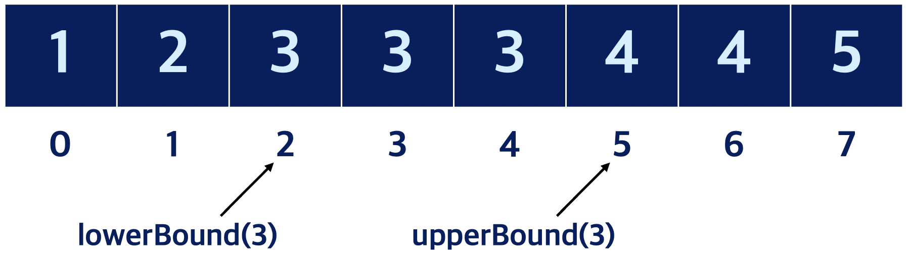

> 이 글은 Javascript를 이용해 정렬된 배열에서 특정 수의 lower bound, upper bound를 구하는 방법에 대해 설명한다.

**이진 탐색 알고리즘(binary search algorithm)**은 오름차순으로 정렬된 배열에서 특정한 값의 위치를 찾는 알고리즘이다. **Upper bound, Lower bound 알고리즘은 이진 탐색에서 파생**된 것으로, 이진탐색과 마찬가지로 배열 안의 숫자들이 **오름차순으로 정렬되어 있을 때 이용할 수 있다**. **<u>k의 Lower bound는 배열에서 원하는 값 k 이상의 수가 처음으로 나오는 위치</u>이고, <u>k의 Upper bound는 k를 초과하는 수가 처음으로 나오는 위치</u>이다.**



# Lower bound

**Lower bound 알고리즘은 원하는 값 k 이상의 수가 처음으로 나오는 위치를 찾는다.** 파악하고자 하는 구간의 시작 위치를 start, 끝 위치를 end라고 할 때, **<u>구간의 시작 위치가 끝 위치보다 뒤에 오기 전까지</u> 다음 과정을 반복**한다.

- **<u>중간 지점 mid 위치의 값이 k보다 작을 때:</u>** mid가 lower bound가 될 수 없으므로, 더 큰 값을 찾기 위해 뒷 구간 **[mid+1, end]에 대해 이 과정을 반복**한다.
- **<u>그 외의 경우:</u>** mid가 lower bound 값이 될 수 있으므로, **결과 변수에 기존 값과 mid를 비교해 더 작은 값을 저장**하고, lower bound가 될 수 있는 더 작은 값이 있는지 파악하기 위해 앞 **구간 [start, mid-1]에 대해 이 과정을 반복**한다.

위 알고리즘은 **재귀, 반복문** 2가지 방법으로 다음과 같이 구현할 수 있다. 

```jsx
const numList = [1, 2, 3, 3, 3, 4, 4, 5];

const INF = 987654321;
let result1 = INF,
  result2 = INF;

//재귀
const lowerBound1 = (start, end, key) => {
  if (start > end) {
    return;
  }
  const mid = Math.floor((start + end) / 2);
  if (numList[mid] < key) {
    lowerBound1(mid + 1, end, key);
    return;
  }
  result1 = Math.min(result1, mid);
  lowerBound1(start, mid - 1, key);
};

//반복문
const lowerBound2 = (start, end, key) => {
  let mid;
  while (start <= end) {
    mid = Math.floor((start + end) / 2);
    if (numList[mid] < key) {
      start = mid + 1;
      continue;
    }
    result2 = Math.min(result2, mid);
    end = mid - 1;
  }
};

lowerBound1(0, numList.length - 1, 3);
lowerBound2(0, numList.length - 1,3);
console.log(result1, result2);
```

# Upper bound

**Upper bound 알고리즘은 원하는 값 k를 초과하는 수가 처음으로 나오는 위치를 찾는다.** 파악하고자 하는 구간의 시작 위치를 start, 끝 위치를 end라고 할 때, **<u>구간의 시작 위치가 끝 위치보다 뒤에 오기 전까지</u> 다음 과정을 반복**한다.

- **<u>중간 지점 mid 위치의 값이 k 이하일 때:</u>** mid가 upper bound가 될 수 없으므로, 더 큰 값을 찾기 위해 뒷 구간 **[mid+1, end]에 대해 이 과정을 반복**한다.
- **<u>그 외의 경우:</u>** mid가 lower bound 값이 될 수 있으므로, **결과 변수에 기존 값과 mid를 비교해 더 작은 값을 저장**하고, upper bound가 될 수 있는 더 작은 값이 있는지 파악하기 위해 앞 구간 **[start, mid-1]에 대해 이 과정을 반복**한다.

위 알고리즘은 **재귀, 반복문** 2가지 방법으로 다음과 같이 구현할 수 있다. 

```jsx
const numList = [1, 2, 3, 3, 3, 4, 4, 5];

const INF = 987654321;
let result1 = INF,
  result2 = INF;

const upperBound1 = (start, end, key) => {
  if (start > end) {
    return;
  }
  const mid = Math.floor((start + end) / 2);
  if (numList[mid] <= key) {
    upperBound1(mid + 1, end, key);
    return;
  }
  result1 = Math.min(result1, mid);
  upperBound1(start, mid - 1, key);
};

const upperBound2 = (start, end, key) => {
  let mid;
  while (start <= end) {
    mid = Math.floor((start + end) / 2);
    if (numList[mid] <= key) {
      start = mid + 1;
      continue;
    }
    result2 = Math.min(result2, mid);
    end = mid - 1;
  }
};

upperBound1(0, numList.length - 1, 3);
upperBound2(0, numList.length - 1, 3);
console.log(result1, result2);
```