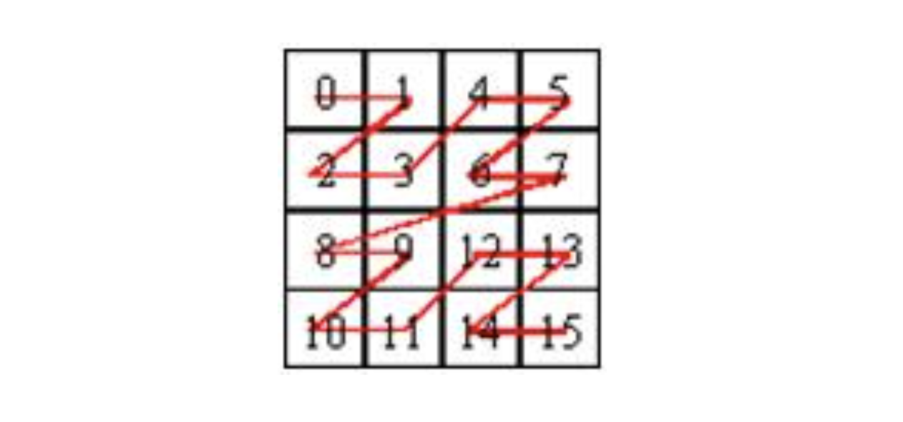
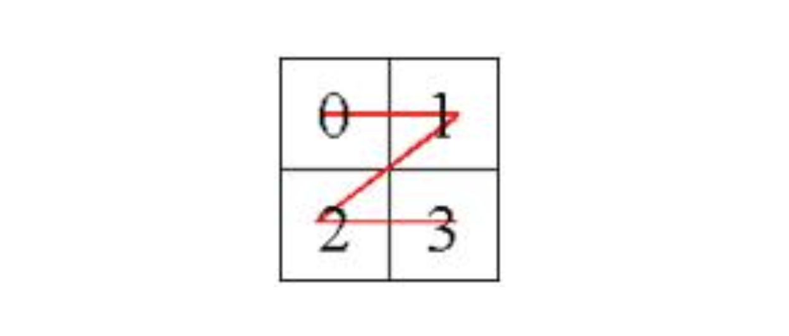

이 글은 백준 1074번 Z를 풀이한다. [문제 링크](https://www.acmicpc.net/problem/1074)<br>
코드는 javascript로 작성되었다.

# 문제 파악

- 2차원 배열을 Z모양으로 탐색한다.
- 배열의 크기는 항상 2^N \* 2^N이다.
- 2차원 배열의 크기가 2^N \* 2^N이라면, 배열을 **<u>4등분</u>** 한 후에 (크기가 같은 2^(N-1)로) **<u>재귀</u>**적으로 순서대로 방문한다.
- **N이 주어졌을 때, (r, c)를 몇 번째로 방문하는지 출력**하는 프로그램을 작성하시오.

### 입력

첫째 줄에 N r c가 주어진다. **N은 15보다 작거나 같은 자연수**이고, **r과 c는 0보다 크거나 같고, 2^(N-1)보다 작거나 같은 정수**이다.

### 출력

첫째 줄에 문제의 정답을 출력한다.

# 문제 풀이

## 접근

> 문제에서 **분할 정복**을 이용해 **재귀**적으로 문제를 해결해야 함을 파악할 수 있다.

## 알고리즘

문제에 나와있는 첫 번째 입력 예시로 답을 구하는 과정을 파악해보자. N, (r,c) = 2, (3,1)이므로 그림에서 목적지의 위치는 11이다.<br>
**첫 번째 점의 방문 순서가 0인데, 이를 1로 놓고 목적지 바로 전의 점까지의 방문 순서를 구해**도 답을 똑같이 도출할 수 있다. 문제에 명시된 대로 **배열을 4등분 한 후에 재귀적으로 방문**해보자.

배열을 4등분했을 때 점은 3사분면(왼쪽 아래)에 위치한다. (r,c)를 몇 번째로 방문하는지 파악해야 하는데, **3사분면에 있는 점을 방문하기 위해서는 1사분면(오른쪽 위)를 먼저 방문해야** 하기 때문에 **<u>결과값에 8을 더한다.</u>**

4등분한 후 점이 위치한 곳을 방문하면 그림에서의 목적지의 위치는 3이다. **4사분면(오른쪽 아래)에 있는 점을 방문하기 위해서는 3사분면을 먼저 방문해야** 하기 때문에 **<u>결과값에 3을 더한다.</u>** 현재 2차원 배열의 크기가 2^1 \* 2^1이기 때문에 한 번 더 배열을 4등분 한 후에 재귀적으로 방문해야 한다.<br><br>
그렇게 되면 2차원 배열의 크기가 2^0 \* 2^0이기 때문에 더 이상 4등분 후 재귀적으로 방문할 필요가 없다. **다시 자신을 호출한 부분으로 돌아가면 된다.**<br><br>
결과값에 더해진 수의 합이 11이므로 **<u>목적지를 11번째로 방문</u>**함을 알 수 있다. 파악한 답 도출 과정을 그대로 코드로 작성하면 된다.

## 코드

```javascript
//https://www.acmicpc.net/problem/1074

let input = [];
let result = 0;

const strToNumArr = (str) => str.split(' ').map((numChar) => Number(numChar));

const search = (r, c, rs, re, cs, ce) => {
  const length = re - rs + 1;
  if (length === 1) return;

  const rhalf = (rs + re) / 2;
  const chalf = (cs + ce) / 2;

  if (r < rhalf && c < chalf) {
    search(r, c, rs, Math.floor(rhalf), cs, Math.floor(chalf));
  }
  if (r < rhalf && c > chalf) {
    result += Math.pow(length / 2, 2);
    search(r, c, rs, Math.floor(rhalf), Math.ceil(chalf), ce);
  }
  if (r > rhalf && c < chalf) {
    result += Math.pow(length / 2, 2) * 2;
    search(r, c, Math.ceil(rhalf), re, cs, Math.floor(chalf));
  }
  if (r > rhalf && c > chalf) {
    result += Math.pow(length / 2, 2) * 3;
    search(r, c, Math.ceil(rhalf), re, Math.ceil(chalf), ce);
  }
};

require('readline')
  .createInterface(process.stdin, process.stdout)
  .on('line', function (line) {
    input.push(line.trim());
  })
  .on('close', function () {
    const [n, r, c] = strToNumArr(input[0]);
    let rs = 0,
      cs = 0,
      re = (1 << n) - 1,
      ce = (1 << n) - 1;
    search(r, c, rs, re, cs, ce);
    console.log(result);
  });
```
