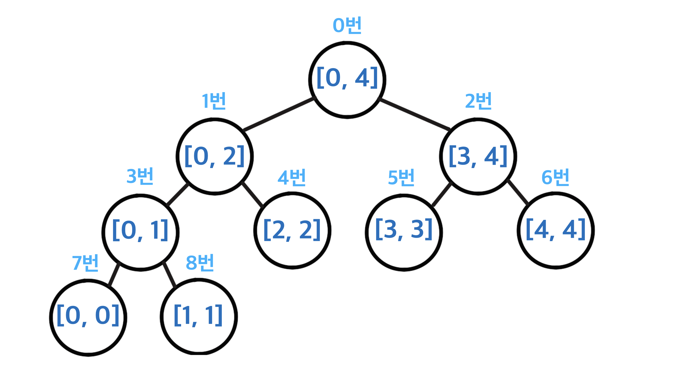
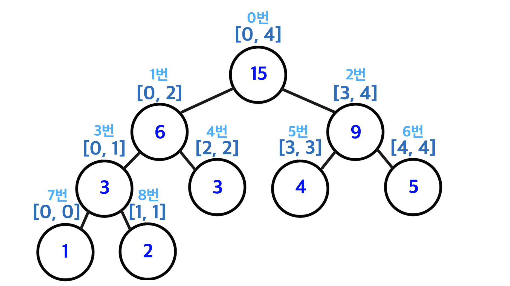
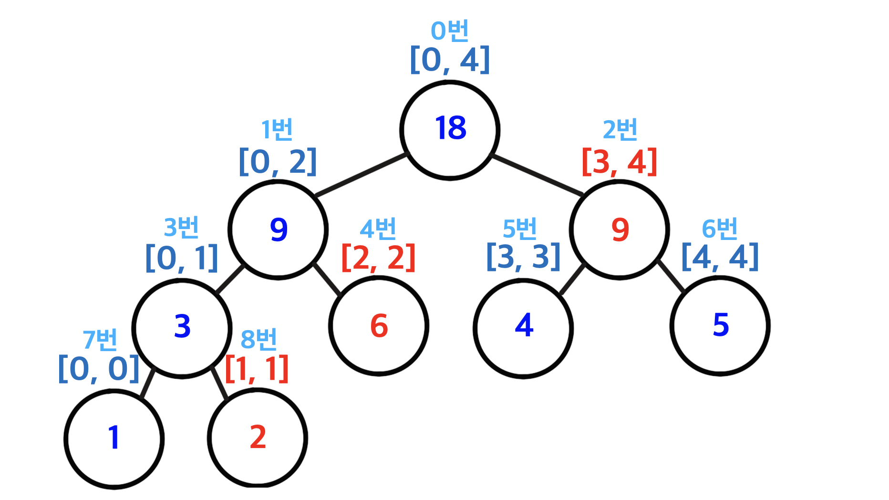
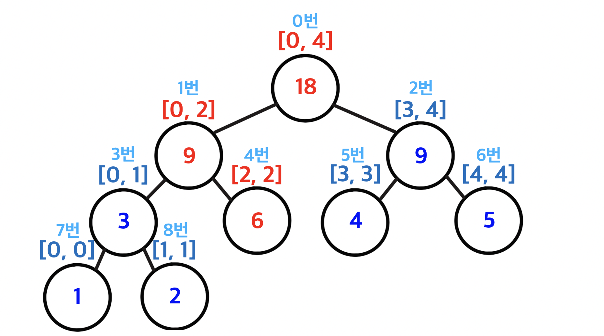

> 이 글은 [백준 2042번 구간 합 구하기](<(https://www.acmicpc.net/problem/2042)>)를 풀이한다. 코드는 javascript로 작성하였다.

# 문제

어떤 N개의 수가 주어져 있다. 그런데 **<u>중간에 수의 변경이 빈번히 일어나고 그 중간에 어떤 부분의 합을 구하려 한다</u>**. 만약에 1,2,3,4,5 라는 수가 있고, 3번째 수를 6으로 바꾸고 2번째부터 5번째까지 합을 구하라고 한다면 17을 출력하면 되는 것이다. 그리고 그 상태에서 다섯 번째 수를 2로 바꾸고 3번째부터 5번째까지 합을 구하라고 한다면 12가 될 것이다.

## 입력

첫째 줄에 **수의 개수 N(1 ≤ N ≤ 1,000,000)**과 **M(1 ≤ M ≤ 10,000)**, **K(1 ≤ K ≤ 10,000)** 가 주어진다. M은 수의 변경이 일어나는 횟수이고, K는 구간의 합을 구하는 횟수이다. 그리고 둘째 줄부터 N+1번째 줄까지 N개의 수가 주어진다. 그리고 N+2번째 줄부터 N+M+K+1번째 줄까지 세 개의 정수 a, b, c가 주어지는데, **a가 1인 경우 b(1 ≤ b ≤ N)번째 수를 c로** 바꾸고 **a가 2인 경우에는 b(1 ≤ b ≤ N)번째 수부터 c(b ≤ c ≤ N)번째 수까지의 합을 구하여 출력**하면 된다.

입력으로 주어지는 모든 수는 -2^63보다 크거나 같고, 2^63-1보다 작거나 같은 정수이다.

### 예제 입력 1

```bash
5 2 2
1
2
3
4
5
1 3 6
2 2 5
1 5 2
2 3 5
```

## 출력

**<u>첫째 줄부터 K줄에 걸쳐 구한 구간의 합을 출력</u>**한다. 단, 정답은 -2^63보다 크거나 같고, 2^63-1보다 작거나 같은 정수이다.

```bash
17
12
```

## 제한

- **시간: 2초**
- 메모리: 256MB

# 풀이

## 접근

이 문제에서는 주어진 구간의 숫자 합을 출력해야 한다. 그렇기 때문에 저장된 자료들을 적절히 전처리해 그들에 대한 질의들을 빠르게 대답할 수 있도록 하는 **<u>구간 트리를 이 문제에 이용하기 적합</u>**하다.

구간 트리의 기본적인 아이디어는 주어진 **<u>배열의 구간들을 표현하는 이진 트리</u>**를 만드는 것이다. 이때 구간 트리의 **루트는 항상 배열의 전체 구간 [0, n-1]을 표현**하며, **한 트리의 왼쪽 자식과 오른쪽 자식은 각각 해당 구간의 왼쪽 반과 오른쪽 반을 표현**한다. 길이가 1인 구간을 표현하는 노드들은 구간 트리의 리프가 된다.

다음 그림은 예제 입력처럼 길이가 5인 배열을 표현하는 구간 트리가 나타내는 구간들이다. **구간 트리의 각 노드는 해당 구간에 대한 계산 결과를 저장**해 둔다. **이 문제에서는 <u>구간의 숫자 합을 각 노드에 저장</u>**한다.



## 알고리즘

### [1] 구간 트리 생성

먼저 구간 트리 `rangeSum`을 배열로 만들어 **각 구간의 숫자 합을 저장**해야 한다. 모든 숫자를 안전하게 저장하려면 배열의 길이를 N을 가장 가까운 2의 거듭제곱으로 올림한 뒤 2를 곱한 수로 설정하면 되는데, 간단하게 **배열의 크기를 4N으로 설정**해도 된다.

그 후 `init()` 함수를 이용해 **<u>각 구간의 숫자 합을 재귀적으로 구한 후 구간 트리에 저장</u>**한다. 구간 트리에 각 노드가 나타내는 구간은 저장하지 않는데, 이는 해당 노드를 찾아가는 과정에서 표현하는 구간을 동적으로 계산할 수 있기 때문에 따로 저장할 필요가 없다. **구간 트리의 <u>루트부터</u>** `init()` 함수 내의 다음 과정을 진행한다.

- **<u>노드가 나타내는 구간의 시작과 끝이 같을 때</u>**: 구간 합이 가리키는 숫자의 값이기 때문에, **해당 숫자를 구간합으로 저장하고 반환**한다.
- **<u>그 외</u>**: **구간을 반으로 나눠 각 구간의 숫자 합을 재귀적으로 구한 후, 둘을 합쳐 해당 구간의 숫자 합을 구한다**.

다음 그림은 예제 입력 1의 숫자들로 구간 트리에 숫자들의 구간 합을 저장한 결과이다.



### [2] 구간 합 출력

구간 트리에서 원하는 구간의 숫자 합을 어떻게 구할 수 있을까? 다음 그림은 예제 입력 1에서 2번 노드부터 5번 노드까지의 합을 어떻게 구하는지 나타낸 그림이다. 문제에서는 노드 번호가 1번부터 시작하는데, 필자는 0번부터 시작하도록 구현했기 때문에 1번 노드부터 4번 노드까지의 합을 구하면 된다. **[1, 4] 구간을 <u>구간 트리의 노드들이 나타내는 구간들로 최소한으로 나누면</u> [1, 1], [2, 2], [3, 4]**이다. **뒤의 <u>세 구간의 구간합을 더하면</u> [1, 4]의 구간합을 구할 수 있다.**



**구간 트리의 <u>루트부터</u>** `query()` 함수 내의 다음 과정을 진행하면 위의 방법대로 원하는 구간의 숫자 합을 구할 수 있다.

- **<u>원하는 구간이 노드가 나타내는 범위 밖일 때</u>**: 해당 구간합을 포함하면 안 되므로 **0을 반환**한다.
- **<u>원하는 구간과 노드가 나타내는 구간의 교집합이 노드가 나타내는 구간일 때</u>**: 구간트리에서 **노드가 나타내는 범위의 구간 합을 반환**한다.
- **<u>그 외</u>**: **구간을 반으로 나눠 각 구간의 숫자 합을 재귀적으로 구한 후, 둘을 합쳐 해당 구간의 숫자 합을 구한다**.

### [3] 숫자 변경에 따른 구간합 갱신

문제에서 수를 변경하고 구간합을 구해야 하는 경우가 있기 때문에, **<u>수를 변경한다면 해당 숫자를 포함하는 구간의 숫자합을 갱신</u>**해주어야 한다.

다음 그림은 예제 입력 1에서 3번 노드(풀이에서는 2번 노드)의 숫자를 6으로 변경함에 따라 바뀐 구간합들을 어떻게 갱신하는지 나타낸 그림이다. **<u>구간 트리에서 변경된 숫자의 인덱스를 나타내는 리프를 찾아 그 값을 변경된 숫자로 갱신하고, 루트에 도달할 때까지 부모 노드로 올라가며 각 노드의 부분합 또한 갱신</u>**한다.



**구간 트리의 <u>루트부터</u>** `update()` 함수 내의 다음 과정을 진행하면 위의 방법대로 변경된 숫자를 포함하는 구간들의 숫자합을 갱신할 수 있다.

- **<u>변경된 숫자의 위치가 노드가 나타내는 범위 밖일 때</u>**: **갱신할 필요가 없으니 기존의 구간합을 반환**한다.
- **<u>변경된 숫자의 위치와 노드가 나타내는 범위가 같을 때</u>**: **변경된 숫자의 값을 반환**한다.
- **<u>그 외</u>**: **구간을 반으로 나눠 각 구간의 갱신된 숫자 합을 재귀적으로 구한 후, 둘을 합쳐 해당 구간의 숫자 합을 구한다**.

## 구현

아래 코드 + 설명 있습니당

### 코드

```jsx
const input = [];

const strToNumArr = (str) => str.split(' ').map(Number);

class RangeSumTree {
  constructor(numbers) {
    this.n = numbers.length;
    this.rangeSum = [...Array(4 * this.n)];
    this.init(numbers);
  }

  init = (numbers, nodeIndex = 0, rangeStart = 0, rangeEnd = this.n - 1) => {
    if (rangeStart === rangeEnd) {
      return (this.rangeSum[nodeIndex] = numbers[rangeStart]);
    }
    const mid = Math.floor((rangeStart + rangeEnd) / 2);
    const leftRangeSum = this.init(numbers, nodeIndex * 2 + 1, rangeStart, mid);
    const rightRangeSum = this.init(
      numbers,
      nodeIndex * 2 + 2,
      mid + 1,
      rangeEnd
    );
    return (this.rangeSum[nodeIndex] = leftRangeSum + rightRangeSum);
  };

  query = (from, to, nodeIndex = 0, rangeStart = 0, rangeEnd = this.n - 1) => {
    if (from > rangeEnd || to < rangeStart) {
      return 0;
    }
    if (from <= rangeStart && to >= rangeEnd) {
      return this.rangeSum[nodeIndex];
    }
    const mid = Math.floor((rangeStart + rangeEnd) / 2);
    const leftRangeSum = this.query(
      from,
      to,
      nodeIndex * 2 + 1,
      rangeStart,
      mid
    );
    const rightRangeSum = this.query(
      from,
      to,
      nodeIndex * 2 + 2,
      mid + 1,
      rangeEnd
    );
    return leftRangeSum + rightRangeSum;
  };

  update = (
    numIndex,
    newNum,
    nodeIndex = 0,
    rangeStart = 0,
    rangeEnd = this.n - 1
  ) => {
    if (numIndex < rangeStart || numIndex > rangeEnd) {
      return this.rangeSum[nodeIndex];
    }
    if (rangeStart === rangeEnd) {
      return (this.rangeSum[nodeIndex] = newNum);
    }
    const mid = Math.floor((rangeStart + rangeEnd) / 2);
    const leftRangeSum = this.update(
      numIndex,
      newNum,
      nodeIndex * 2 + 1,
      rangeStart,
      mid
    );
    const rightRangeSum = this.update(
      numIndex,
      newNum,
      nodeIndex * 2 + 2,
      mid + 1,
      rangeEnd
    );
    return (this.rangeSum[nodeIndex] = leftRangeSum + rightRangeSum);
  };
}

require('readline')
  .createInterface(process.stdin, process.stdout)
  .on('line', function (line) {
    input.push(line.trim());
  })
  .on('close', function () {
    let inputIndex = 0;
    const [N, M, K] = strToNumArr(input[inputIndex++]);
    const numbers = [...Array(N)].map(() => Number(input[inputIndex++]));

    const rangeSumTree = new RangeSumTree(numbers);
    let t = M + K;
    const result = [];
    while (t--) {
      const [operationNum, b, c] = strToNumArr(input[inputIndex++]);
      if (operationNum === 1) {
        rangeSumTree.update(b - 1, c);
        continue;
      }
      result.push(rangeSumTree.query(b - 1, c - 1));
    }
    console.log(result.join('\n'));
  });
```

### 코드+설명

```jsx
const input = [];

const strToNumArr = (str) => str.split(' ').map(Number);

//구간 별 숫자 합을 저장하는 트리
class RangeSumTree {
  constructor(numbers) {
    //숫자 개수
    this.n = numbers.length;
    //nodeIndex번 노드가 나타내는 숫자 범위
    //rangeStart ~ rangeEnd의 숫자 합을 저장하는 트리.
    //크기를 4n으로 초기화
    this.rangeSum = [...Array(4 * this.n)];
    //numbers 참고해서 트리에 구간 별 숫자 합 저장
    this.init(numbers);
  }

  //nodeIndex번 노드가 나타내는 숫자 범위는 rangeStart ~ rangeEnd
  //해당 구간의 숫자 합을 반환.
  init = (numbers, nodeIndex = 0, rangeStart = 0, rangeEnd = this.n - 1) => {
    //노드가 나타내는 범위의 시작과 끝이 같으면
    if (rangeStart === rangeEnd) {
      //rangeSum = 범위가 가리키는 숫자
      //rangeSum의 nodeIndex 위치에 숫자를 저장하고 반환.
      return (this.rangeSum[nodeIndex] = numbers[rangeStart]);
    }
    //아니면 해당 구간을 반으로 나눠 해당 구간의 숫자의 합을 재귀적으로 구함.
    const mid = Math.floor((rangeStart + rangeEnd) / 2);
    const leftRangeSum = this.init(numbers, nodeIndex * 2 + 1, rangeStart, mid);
    const rightRangeSum = this.init(
      numbers,
      nodeIndex * 2 + 2,
      mid + 1,
      rangeEnd
    );
    return (this.rangeSum[nodeIndex] = leftRangeSum + rightRangeSum);
  };

  //합을 구하고자 하는 구간의 범위는 from ~ to
  //nodeIndex번 노드가 나타내는 숫자 범위는 rangeStart ~ rangeEnd
  //rangeStart ~ rangeEnd, from ~ to의 교집합 구간의 숫자 합 반환
  query = (from, to, nodeIndex = 0, rangeStart = 0, rangeEnd = this.n - 1) => {
    //구하고자 하는 구간이 노드가 나타내는 범위 밖일 때
    if (from > rangeEnd || to < rangeStart) {
      return 0;
    }
    //구간들의 교집합이 rangeStart ~ rangeEnd일 때
    if (from <= rangeStart && to >= rangeEnd) {
      //노드가 나타내는 범위의 구간 합 반환
      return this.rangeSum[nodeIndex];
    }
    //그 외에는 노드가 나타내는 구간을 반으로 나눠 구간 숫자 합을 재귀적으로 구함.
    const mid = Math.floor((rangeStart + rangeEnd) / 2);
    const leftRangeSum = this.query(
      from,
      to,
      nodeIndex * 2 + 1,
      rangeStart,
      mid
    );
    const rightRangeSum = this.query(
      from,
      to,
      nodeIndex * 2 + 2,
      mid + 1,
      rangeEnd
    );
    return leftRangeSum + rightRangeSum;
  };

  //numIndex번 숫자의 값을 newNum으로 변경,
  //numIndex가 포함된 구간의 구간 합 값을 갱신
  //nodeIndex번 노드가 나타내는 숫자 범위는 rangeStart ~ rangeEnd
  //갱신 후 구간 합 반환
  update = (
    numIndex,
    newNum,
    nodeIndex = 0,
    rangeStart = 0,
    rangeEnd = this.n - 1
  ) => {
    //numIndex 위치가 구간에 포함 안 될 때
    if (numIndex < rangeStart || numIndex > rangeEnd) {
      //갱신할 필요 없으므로 기존 구간 합 반환
      return this.rangeSum[nodeIndex];
    }
    //노드가 나타내는 범위의 시작과 끝이 같으면
    if (rangeStart === rangeEnd) {
      //rangeSum = 범위가 가리키는 숫자
      //rangeSum의 nodeIndex 위치의 숫자 newNum으로 변경 후 반환.
      return (this.rangeSum[nodeIndex] = newNum);
    }
    //아니면 해당 구간을 반으로 나눠 해당 구간의 숫자의 합을 재귀적으로 갱신.
    const mid = Math.floor((rangeStart + rangeEnd) / 2);
    const leftRangeSum = this.update(
      numIndex,
      newNum,
      nodeIndex * 2 + 1,
      rangeStart,
      mid
    );
    const rightRangeSum = this.update(
      numIndex,
      newNum,
      nodeIndex * 2 + 2,
      mid + 1,
      rangeEnd
    );
    return (this.rangeSum[nodeIndex] = leftRangeSum + rightRangeSum);
  };
}

require('readline')
  .createInterface(process.stdin, process.stdout)
  .on('line', function (line) {
    input.push(line.trim());
  })
  .on('close', function () {
    let inputIndex = 0;
    const [N, M, K] = strToNumArr(input[inputIndex++]);
    const numbers = [...Array(N)].map(() => Number(input[inputIndex++]));

    const rangeSumTree = new RangeSumTree(numbers);
    let t = M + K;
    const result = [];
    while (t--) {
      const [operationNum, b, c] = strToNumArr(input[inputIndex++]);
      if (operationNum === 1) {
        rangeSumTree.update(b - 1, c);
        continue;
      }
      result.push(rangeSumTree.query(b - 1, c - 1));
    }
    console.log(result.join('\n'));
  });
```
