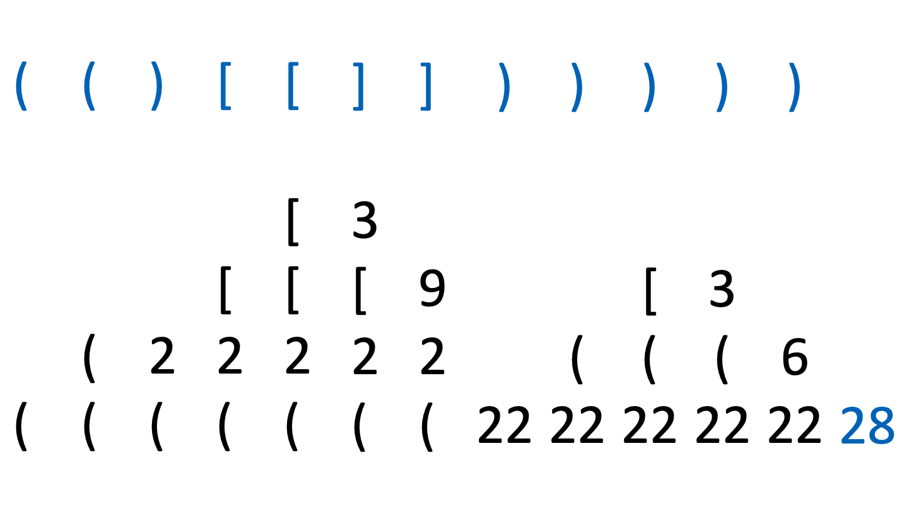

이 글은 백준 2504번 괄호의 값을 풀이한다. [문제 링크](https://www.acmicpc.net/problem/2504)<br>
코드는 javascript로 작성하였다.

# 문제 파악

- 괄호열은 4개의 기호를 이용해 만들어진다. ‘(’, ‘)’, ‘[’, ‘]’
- 다음은 올바른 괄호열이다.
  - ‘()’, ‘[]’
  - X와 Y 모두 올바른 괄호열일 때, ‘(X)’, ‘[X]’, XY
- 괄호열의 값을 아래와 같이 정의한다.
  - ‘()’ 괄호열의 값은 2
  - ‘[]’ 괄호열의 값은 3
  - ‘(X)’ 괄호열의 값은 2×값(X)
  - ‘[X]’ 괄호열의 값은 3×값(X)
  - 올바른 괄호열 X와 Y가 결합된 XY 괄호열의 값은 값(XY)= 값(X)+값(Y)

### 입력

첫째 줄에 괄호열을 나타내는 문자열(스트링)이 주어진다. 단 그 길이는 1 이상, 30 이하이다.

### 출력

첫째 줄에 그 **괄호열의 값을 나타내는 정수를 출력**한다. 만일 **입력이 올바르지 못한 괄호열이면 반드시 0을 출력**해야 한다.<br>

# 문제 풀이

## 접근

괄호열이 올바른지 확인하는 과정을 살펴보자.<br>
(~~()~~[[]])<br>
(~~()~~[~~[]~~])<br>
(~~()[[]]~~)<br>
~~(()[[]])~~<br>
닫는 괄호가 나왔을 때, 해당 괄호보다 **전에 있는 괄호들 중 지워지지 않은 <u>가까운 괄호부터</u>** 짝 괄호인지 확인하면 된다.

> 그렇기 때문에 이 문제는 **스택**을 이용해서 풀기에 적합하다.

## 알고리즘

괄호열을 앞에서부터 탐색하는데, **여는 괄호**가 나오면 **스택에 <u>삽입</u>**하고, **닫는 괄호**가 나오면 **스택에서 요소 한 개를 <u>꺼내어(삭제) 확인</u>**한다.

- 해당 요소가 **짝 괄호일 때**, **‘(’라면 <u>2</u>를, ‘[’라면 <u>3</u>을 스택에 <u>삽입</u>**한다.
- 해당 요소가 **숫자일 때**, **<u>짝 괄호가 나올 때까지</u> 스택에서 요소를 하나씩 <u>꺼내어 확인</u>**한다.
  - **짝 괄호가 나오면** **<u>그동안 확인한 숫자들을 더한 것에</u> ‘(’라면 <u>2</u>를, ‘[’라면 <u>3</u>을 <u>곱하여</u> 스택에 <u>삽입</u>**한다.
  - **짝 괄호가 아닌 괄호가 나오거나, 끝까지 짝 괄호가 나오지 않으면** 입력된 괄호열의 형식은 **<u>올바르지 않다</u>**. ex. _`([]]`_, _`[]]`_
- 해당 요소가 **짝 괄호가 아닌 괄호일 때**, 입력된 괄호열의 형식은 **<u>올바르지 않다</u>**.<br> ex. _`(]`_

괄호열을 **다 탐색했는데 스택에 괄호열이 남아있다면** 입력된 괄호열의 형식은 **<u>올바르지 않다</u>**. ex. _`()(`_
**그렇지 않은 경우 <u>스택에 남은 숫자들을 더해</u>**주면 그것이 답이다.<br><br>
위의 방법대로 예시 입력 *`(()[[]])([])`*의 답을 구해보면 다음과 같다.


## 코드

```javascript
//https://www.acmicpc.net/problem/2504

const input = [];
const stack = [];

const parseBracket = (bracket) => {
  const bracketPair = bracket === ')' ? '(' : '[';
  const lastStackElement = stack.pop();

  if (lastStackElement === bracketPair) {
    stack.push(bracketPair === '(' ? 2 : 3);
    return true;
  }
  if (typeof lastStackElement === 'number') {
    let temp = lastStackElement;
    let t = stack.length;
    while (t--) {
      const lastStackElement = stack.pop();
      if (lastStackElement === bracketPair) {
        stack.push(temp * (bracketPair === '(' ? 2 : 3));
        return true;
      } else if (typeof lastStackElement === 'number') {
        temp += lastStackElement;
        continue;
      } else {
        return false;
      }
    }
  }
  return false;
};

require('readline')
  .createInterface(process.stdin, process.stdout)
  .on('line', function (line) {
    input.push(line.trim());
  })
  .on('close', function () {
    const bracketList = input[0].split('');
    let i = 0;
    do {
      const bracket = bracketList[i];
      if (bracket === '(' || bracket === '[') stack.push(bracket);
      else {
        if (!parseBracket(bracket)) {
          console.log(0);
          break;
        }
      }
      i++;

      if (i === bracketList.length) {
        if (stack.length > 0 && !stack.find((e) => typeof e === 'string'))
          console.log(stack.reduce((acc, curr) => acc + curr));
        else console.log(0);
      }
    } while (i < bracketList.length);
  });
```
