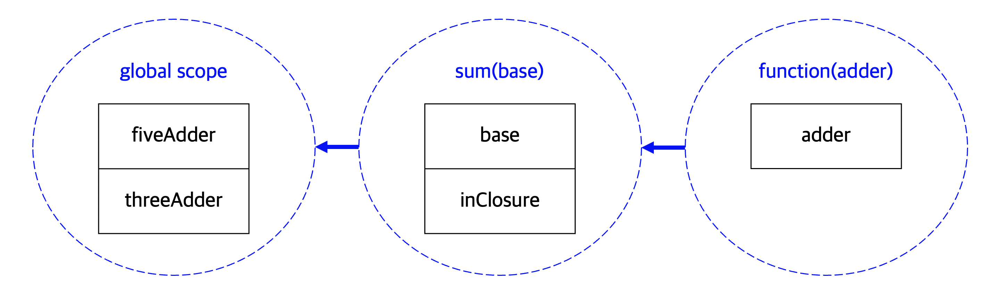
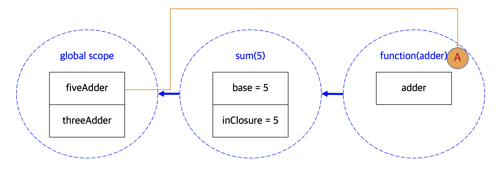
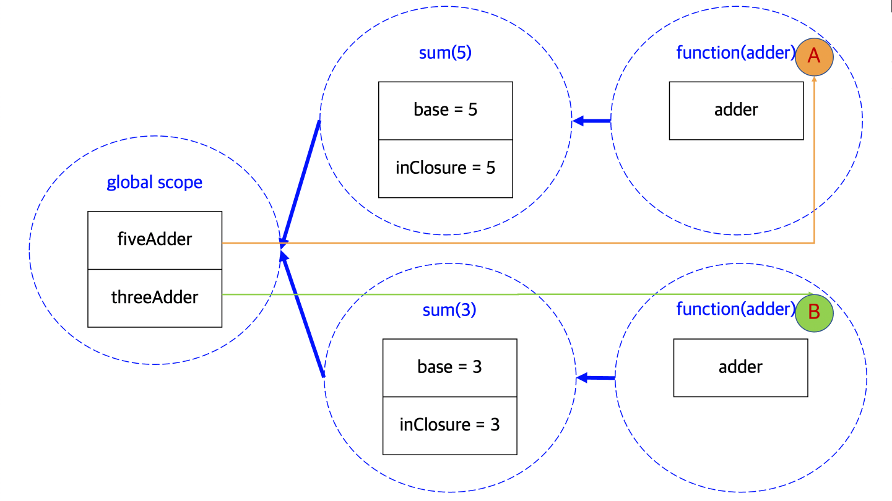

> 이 글은 JavaScript의 동작을 이해하는 데에 필수적인 개념, 스코프와 클로저에 대해 설명한다. [MDN 클로저 문서](https://developer.mozilla.org/ko/docs/Web/JavaScript/Closures)와 책 속깊은 JavaScript의 내용의 일부를 요약, 정리하여 글을 작성했다.

# 스코프란?

**<u>스코프</u>란 <u>현재 접근할 수 있는 변수들의 범위</u>**를 뜻한다.

## 스코프의 생성

### let이 등장하기 이전

ES6 문법에 `let`이 추가되기 전, 자바스크립트는 다른 언어와는 달리 일반적인 블록 스코프를 따르지 않았다. **<u>다음 구문들을 사용할 때에만 스코프가 생성</u>**되었다.

- `function`
- `with`
- `catch`

`function` 구문을 사용하면 **<u>함수 외부에서 내부에 선언된 변수에 접근할 수 없고</u>**, `with`와 `catch` 구문은 **괄호 안에 인자로 받는 변수들만 새로운 내부 스코프에 포함되어 그 다음으로 오는 블록 안에서만 접근**할 수 있다.

```jsx
//function 구문
function foo() {
  var a = 'hi';
}
console.log(typeof a === 'undefined'); //true
```

```jsx
//catch 구문
try {
  throw new exception('fake exception');
} catch (err) {
  var test = 'can you see me';
  console.log(err instanceof ReferenceError === true); //true
}
console.log(test === 'can you see me'); //true
console.log(typeof err === 'undefined'); //true
```

```jsx
//with 구문
with ({ inScope: "You can't see me" }) {
  var notInScope = 'But you can see me';
  console.log(inScope === "You can't see me"); //true
}
console.log(typeof inScope === 'undefined'); //true
console.log(notInScope === 'But you can see me'); //true
```

+) [with 구문](https://developer.mozilla.org/ko/docs/Web/JavaScript/Reference/Statements/with)은 자바스크립트 구문 중 `eval` 구문과 함께 사용하지 말아야 할 구문 중 하나이다.

### let의 등장

`let`이 등장하면서 **<u>javascript에서도 블록 스코프를 이용할 수 있게 되었다</u>**. 블록 스코프를 구분하는 블록문은 한쌍의 중괄호로 구성되며 선택적으로 이름을 붙일 수 있다. `let`으로 선언된 변수는 **블록 밖에서 접근할 수 없고**, `var`은 **여전히 블록과 상관 없이 자신의 정의를 유지**해 기존에 만들어진 웹페이지들이 계속 동작하도록 하고 있다.

```jsx
var x = 1;
let y = 1;

if (true) {
  var x = 2;
  let y = 2;
}

console.log(x); //2
console.log(y); //1
```

## 스코프의 지속성

엄밀히 따져보면 javascript에서 스코프가 생성되는 방식이 기존 언어들과 다르지는 않지만, **<u>스코프가 지속되는 것은 다른 언어들과는 다른 javascript만의 강점</u>** 중 하나이다.

**자바스크립트에서 스코프 지속성이 필요한 이유는, 새로운 스코프가 생성된 후 스코프 체인을 참조하는 함수를 변수에 넣을 수도 있고, 다른 함수의 인자로 넘겨줄 수도 있으며, 함수의 반환값으로 활용할 수도 있기 때문**이다. 즉, 지금 **<u>함수가 선언된 곳이 아니라 다른 곳에서 함수가 호출될 수도 있어 해당 함수가 현재 참조하는 스코프를 지속할 필요가 있는 것</u>**이다.

# 클로저란?

**자바스크립트에서는 <u>특정 함수가 참조하는 변수들이 선언된 어휘적 환경(Lexical scope)</u>이 계속 유지되는데, 그 함수와 스코프**를 묶어서 **<u>클로저</u>**라고 한다. 여기서 "lexical"이란, 변수가 소스코드 내 어디에서 선언되었는지 고려한다는 사실을 의미한다. **스코프가 중첩되었을 때에는 내부 스코프에서 외부 스코프에서 선언된 변수에도 접근할 수 있다**.

## 클로저 쉽게 이해하기

**<u>클로저가 나타나는 가장 기본적인 환경은 스코프 안에 스코프가 있을 때</u>**이다. 아래 소스가 실행됨에 따라 스코프 체인이 내부적으로 어떻게 구성되는지 살펴보면서 클로저를 이해해보자.

```jsx
function sum(base) {
  var inClosure = base;
  return function (adder) {
    return inClosure + adder;
  };
}
var fiveAdder = sum(5); //inClosure = 5 and return function
fiveAdder(3); //5(inClosure) + 3(adder) === 8
var threeAdder = sum(3); //inClosure = 3 and return function
```

외부에서 `sum()` 함수를 호출하면 파라미터 `base`를 통해서 넘어온 값은 `inClosure` 변수에 저장된다. 그리고 내부함수에서는 `inClosure` 변수를 참조한다. 이와 같은 소스코드가 실행될 때의 스코프 체인 구조를 미리 나타내면 다음과 같다.



위 그림은 `sum()` 함수가 실제로 호출되었을 때를 가정하여 스코프가 생성되는 구조를 보인 것이다. 스코프의 뼈대, 혹은 템플릿이라고 보면 된다. 그럼 위의 템플릿을 토대로 함수가 실행되는 과정을 한 줄씩 살펴보자.

```jsx
var fiveAdder = sum(5); //inClosure = 5 and return function
```

7번 줄에서 `sum()` 함수가 호출되고 파라미터 `base`의 값은 5로 넘어와서 `inClosure` 변수의 값이 5로 설정된다. 그리고 `inClosure` 변수를 참조하는 내부 함수를 반환하여 `fiveAdder`에 저장한다. 현재 `fiveAdder`의 스코프 상황은 다음과 같을 것이다.



위의 스코프 템플릿에서 `fiveAdder`는 실제로 사용하게 되는 함수 A를 할당받게 되어 오른쪽의 A 함수를 가지고 있게 된다. 그리고 **<u>A가 반환될 때는 위와 같이 스코프 체인을 생성</u>하여 fiveAdder 함수가 호출될 때 이 스코프 체인을 사용**하게 된다. **`fiveAdder`에서 할당받는 함수 A는 3번 줄에서 반환되고 있는 익명 함수**이다.

이제부터 `fiveAdder`**를 통해 함수를 호출하게 되면 위의 스코프 체인을 따르게 된다**. 그림만 살펴보면 순환 구조로 되어있는 것 같지만, 모든 스코프 체인은 글로벌 영역에서 끝난다. 그리고 **글로벌 영역에서 `fiveAdder`가 가지고 있는 것**은 다시 A를 참조하는 스코프 체인이 아니라 **<u>함수 A에 대한 레퍼런스</u>**, C언어로 말하자면 포인터를 가지고 있는 것이다. **JavaScript에서는 함수가 [Function 객체](https://developer.mozilla.org/ko/docs/Web/JavaScript/Reference/Global_Objects/Function)**이기 때문이다. 이 함수 A가 사용하는 **스코프 체인은 함수 A를 가리키는 레퍼런스가 사라질 때까지 계속 남아있게 되어 <u>스코프가 계속 유지</u>**된다.

```jsx
fiveAdder(3); //5(inClosure) + 3(adder) === 8
```

이제 8번 줄의 `fiveAdder(3)`이 호출되면, 위의 스코프 체인에서 `inClosure`는 5를 가지고, 함수 A의 파라미터 `adder`로 들어온 값이 3을 더하여 8이라는 값이 반환된다.

```jsx
var threeAdder = sum(3); //inClosure = 3 and return function
```

이번에 다시 `threeAdder`를 호출하게 되면 어떻게 될까? 위의 함수 A에 대한 스코프 체인에 영향을 미쳐서 `inClosure` 변수의 값을 3으로 덮어쓸 것 같지만 그렇지 않다.



위와 같이 `sum()` 함수가 호출되면서 다시 3번 줄의 함수 표현식이 실행되면 함수 B는 **<u>새로운 스코프 체인을 생성</u>**하여, 이번에는 `threeAdder` 변수에 함수 B를 가리키는 레퍼런스를 넣는다. 이처럼 **같은 함수를 통해서 받은 값은 각각 A와 B로 두 개의 함수가 생성되어, <u>`fiveAdder`로 호출하면 A의 스코프 체인을 사용하고, `threeAdder`로 호출하면 B의 스코프 체인을 사용</u>**한다.

이처럼 **<u>클로저를 통해서 각 함수는 자기만의 고유한 값을 보유하고 스코프 체인을 유지하면서 그 체인 안에 있는 모든 값들을 유지</u>**한다. `sum()` 함수를 호출할 때마다 같은 모양의 함수들이 매번 새롭게 나오지만, **두 함수가 같지 않은 이유는 두 함수가 할당받은 스코프 체인, 숨겨져 있는 클로저가 다르기 때문**이다.
