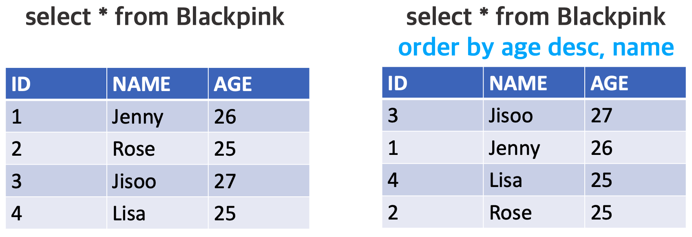

> 이 글은 MySQL에서 order by 명령어를 어떻게 사용하는지에 대해 설명한다. 

MySQL에서 **<u>특정 column의 데이터를 기준으로 레코드들을 정렬</u>**해 보고 싶다면 **`order by`** 명령어를 이용하면 된다.

만약 Blackpink 테이블에 데이터가 아래 그림의 왼쪽 표처럼 구성되어있고, 테이블에서 **데이터를 나이(`age`)에 대해 내림차순으로, 이름(`name`)에 대해 오름차순으로 정렬**해 보고 싶다면 명령어를 다음과 같이 입력하면 된다.



```sql
--order by (column 이름) (asc/desc)*, ...
select * from Blackpink order by age desc, name;
select * from Blackpink order by age desc, name asc;
```

order by는 기본적으로 데이터를 오름차순으로 정렬하기 때문에, **<u>오름차순 정렬</u>을 하고 싶을 때에는 column 이름 뒤에 `asc`를 써도, 써주지 않아도 된다**. **<u>내림차순 정렬</u>을 하고 싶다면 뒤에 `desc`를 써주어야 한다.** **다중 정렬을 하는 상황에서는 <u>앞에 쓴 column을 우선으로 정렬</u>**한다. 

