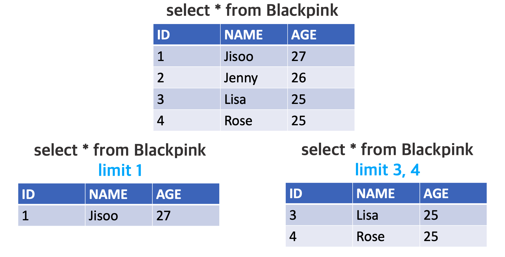

> 이 글은 MySQL에서 limit 명령어를 어떻게 사용하는지에 대해 설명한다.

MySQL에서 **<u>특정 row들의 데이터</u>**를 보고 싶다면 `limit` 명령어를 이용하면 된다.

`Blackpink` 테이블에 데이터가 아래 그림의 왼쪽 표처럼 나이가 많은 순으로 구성되어 있다고 하자.  
이때 나이가 가장 많은 사람의 데이터를 출력하고 싶다면 왼쪽처럼, 나이가 3, 4번째로 많은 사람을 출력하고 싶다면 오른쪽처럼 명령어를 입력해주면 된다.



```sql
//limit (시작 row 번호)* (끝 row 번호);
select * from Blackpink limit 1;
select * from Blackpink limit 1, 1;

select * from Blackpink limit 3, 4;
```

limit 명령어를 입력할 때 시작 **row 번호를 생략하면 1번 row부터 끝 번호 row까지의 데이터를 출력**한다.
