> 이 글은 MySQL의 distinct와 집계 함수들(count, max, min, sum, avg)에 대해 설명한다.

다음과 같은 테이블이 있다고 가정하자.

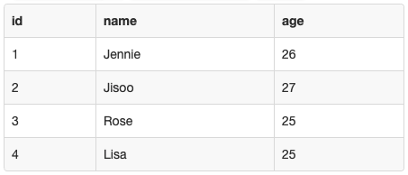

`count()` 함수는 **인수로 주어진 필드의 레코드 개수를 반환**한다. count()는 값이 **null인 레코드를 세지 않는다**. 만약 **컬럼의 unique한 레코드 값의 개수**를 구하고 싶다면, `distinct`를 이용하면 된다. 다음은 count()의 활용 예시이다.

```sql
-- 레코드의 개수
select count(*) from Blackpink;
-- 나이 종류 개수(중복되지 않음)
select count(distinct age) from Blackpink;

-- (+)나이 종류
select distinct age from Blackpink;
```

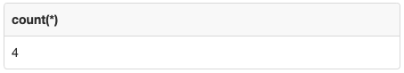

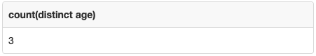

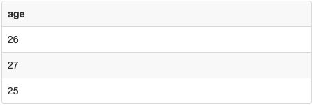

`max()` 함수는 **인수로 주어진 필드의 값들 중 최댓값을 반환**한다.

`min()` 함수는 **인수로 주어진 필드의 값들 중 최솟값을 반환**한다.

`sum()` 함수는 **인수로 주어진 필드의 값들의 합을 반환**한다.

`avg()` 함수는 **인수로 주어진 필드의 값들의 평균을 반환**한다.

다음은 이 함수들의 활용 예시이다.

```sql
-- 최대 나이
select max(age) from Blackpink;
-- 최소 나이
select min(age) from Blackpink;
-- 멤버들의 나이 합
select sum(age) from Blackpink;
-- 멤버들의 나이 평균
select avg(age) from Blackpink;
```

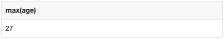

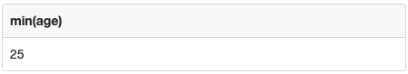

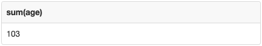

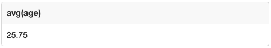

위 네 함수들을 이용해 다음과 같은 **더 복잡한 연산**도 수행할 수 있다.

```sql
-- 제일 나이가 많은 멤버의 이름
select name from Blackpink where age = (select max(age) from Blackpink);
-- 제일 나이가 적은 멤버의 이름
select name from Blackpink where age = (select min(age) from Blackpink);
-- 나이가 멤버들의 평균 나이보다 많은 멤버의 이름
select name from Blackpink where age > (select avg(age) from Blackpink);
```

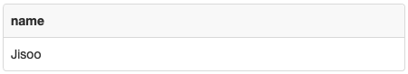

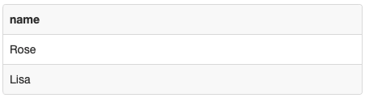

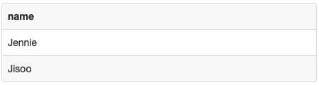
