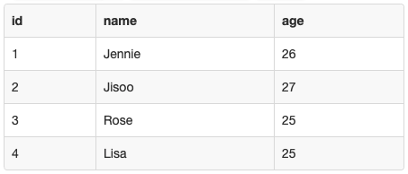
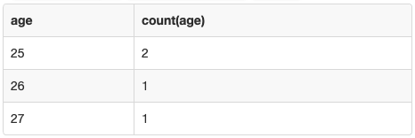
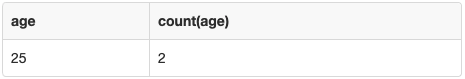

> 이 글은 MySQL에서 group by와 having으로 데이터를 그룹화하여 조회하는 방법에 대해 설명한다.

테이블의 컬럼에서 유형별로 데이터의 개수를 알아내고 싶다면 어떻게 해야 할까? `count()`로 데이터를 조회하려고 하면, 전체 데이터의 개수만 조회할 수 있어 유형별 데이터의 개수를 알아낼 수 없다. 이렇게 **<u>특정 컬럼에서 유형별로 레코드의 개수를 알고 싶을 때에는 `group by` 명령어를 이용해 특정 컬럼을 기준으로 데이터를 그룹화</u>**할 수 있다. group by 명령어로 데이터를 그룹화하면, **<u>집계 함수</u>(max, min, sum, count, avg...)<u>를 사용하기에 용이</u>**해진다.

다음과 같은 표가 있다고 가정하자.

```sql
CREATE TABLE Blackpink (
 id       INT AUTO_INCREMENT,
 name     VARCHAR(20),
 age      INT,
 PRIMARY KEY(id)
);

INSERT INTO Blackpink(name, age) VALUES ('Jennie', 26);
INSERT INTO Blackpink(name, age) VALUES ('Jisoo', 27);
INSERT INTO Blackpink(name, age) VALUES ('Rose', 25);
INSERT INTO Blackpink(name, age) VALUES ('Lisa', 25);

select * from Blackpink;
```



만약 멤버들의 **나이 종류와 나이별 멤버 수를 출력**하고 싶다면, 명령어를 다음과 같이 입력하면 된다. 

```sql
-- group by (그룹화할 컬럼 이름)
select age, count(age) from Blackpink group by age;
```



위의 그림에서 확인할 수 있듯이, `group by`는 `distinct`와 다르게 특정 컬럼을 기준으로 데이터를 그룹화한 후 **정렬하여 결과를 내보낸다**. 두 명령어는 **컬럼의 unique한 레코드 값과 관련**되어 유사하다고 생각할 수 있지만,  `distinct`는 **특정 컬럼의 unique한 레코드 값의 개수**를 구할 때 유용하고, `group by`는 **특정 컬럼의 unique한 레코드별로 데이터를 그룹화한 후 집계함수를 사용하기에 적합**하다. 

`group by`**를 이용해 <u>데이터를 그룹화한 결과에 조건을 걸고 싶을 땐** `having`**을 이용</u>**하면 된다. `where`과 `having`은 둘 다 **조건을 거는 명령어**지만, `where`은 `group by` **이전**에 실행되고 `having`은 `group by` **이후**에 실행된다는 점에서 차이가 있다. `where`은 컬럼을 기준으로 데이터를 그룹화하기 전의 결과에 조건을 걸고 `having`은 그룹화된 결과에 조건을 건다.

만약 멤버들의 **나이 종류와 나이별 멤버 수를 나이별 멤버 수가 1보다 큰 레코드들만 출력**하고 싶다면, 명령어를 다음과 같이 입력하면 된다. 

```sql
select age, count(age) from Blackpink group by age having count(age) > 1;
```

