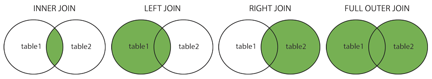
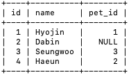
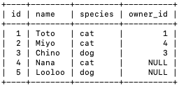
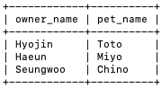
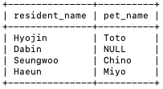
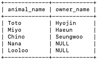
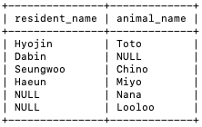

> 이 글은 inner join, outer join이 무엇인지, MySQL에서 join을 어떻게 사용하는지에 대해 설명한다.

# Join

**<u>join</u>은 두 개 이상의 테이블을 관련된 필드들을 기준으로 결합하는 데에 사용**된다. MySQL에서는 `join` 명령어로 두 테이블을 결합할 수 있으며 이때 **결합 조건**은 `on` 명령어로 줄 수 있다.

**<u>join의 종류와 각각의 정의</u>**는 다음과 같다.

- **<u>inner join</u>**: **결합 조건을 만족하는 데이터만** 선택해 두 테이블을 결합한다.
- **<u>outer join</u>**: **결합 조건을 만족하지 않아도 종류에 따라 특정 테이블의 데이터를 모두 선택**해 두 테이블을 결합한다.
  - **<u>left join</u>**: **첫 번째 테이블의 데이터를 모두 선택한 후, 두 번째 테이블의 데이터를 결합 조건에 따라 매칭**한다**.** **매칭되는 데이터가 없는 경우 그 값을 null로 표시**한다.
  - **<u>right join</u>**: **두 번째 테이블의 데이터를 모두 선택한 후, 첫 번째 테이블의 데이터를 결합 조건에 따라 매칭**한다**.** **매칭되는 데이터가 없는 경우 그 값을 null로 표시**한다.
  - **<u>full outer join</u>:** **두 테이블의 데이터를 모두 선택하고, 결합 조건에 따라 데이터를 매칭**한다. **매칭되는 데이터가 없는 경우 그 값을 null로 표시**한다.



다음 두 테이블을 join하는 예제들을 살펴보자.

- `Residents`: A마을 거주자들

  

- `Animals`: A마을에 사는 동물들

  

## Inner Join

**<u>Inner join</u>**은 **결합 조건을 만족하는 데이터만 선택**해 두 테이블을 결합한다. MySQL에서는 `join` 명령어를 이용해 inner join을 구현할 수 있다.

inner join을 이용해 `residents`, `animals` 테이블에서 **주인 이름과 반려동물 이름 조합**들을 출력할 수 있다.

```sql
select residents.name as owner_name, animals.name as pet_name
from residents join animals
on residents.id = animals.owner_id;
```



## Outer Join

**<u>Outer join</u>**은 **결합 조건을 만족하지 않아도 그 종류에 따라 특정 테이블의 데이터를 모두 선택**해 두 테이블을 결합한다.

### Left Join(Left Outer Join)

**<u>Left join</u>**은 **첫 번째 테이블의 데이터를 모두 선택한 후, 두 번째 테이블의 데이터를 결합 조건에 따라 매칭**한다. **이때 매칭되는 데이터가 없는 경우 그 값을 null로 표시**한다. MySQL에서는 `left join` 명령어를 이용해 left join을 구현할 수 있다.

`left join`을 이용해 `residents`, `animals` 테이블에서 **전체 거주자 목록과, 매칭되는 반려동물 이름**을 출력할 수 있다. left join을 했기 때문에 **반려동물이 없는 거주자는 pet_name이 null로 표시**된다.

```sql
select residents.name as resident_name, animals.name as pet_name
from residents left join animals
on residents.id = animals.owner_id;

select residents.name as resident_name, animals.name as pet_name
from residents left outer join animals
on residents.id = animals.owner_id;
```



### Right Join(Right Outer Join)

**<u>Right join</u>**은 **두 번째 테이블의 데이터를 모두 선택한 후, 첫 번째 테이블의 데이터를 결합 조건에 따라 매칭**한다. **이때 매칭되는 데이터가 없는 경우 그 값을 null로 표시**한다. MySQL에서는 `right join` 명령어를 이용해 right join을 구현할 수 있다. **left join**과 **right join**은 데이터를 모두 출력하는 테이블만 다르기 때문에, `A left join B`는 `B right join A`와 같다.

`right join`을 이용해 `residents`, `animals` 테이블에서 **전체 동물 목록과, 매칭되는 주인 이름**을 출력할 수 있다. right join을 했기 때문에 **주인이 없는 동물은 owner_name이 null로 표시**된다.

```sql
select animals.name as animal_name, residents.name as owner_name
from residents right join animals
on residents.pet_id = animals.id;

select animals.name as animal_name, residents.name as owner_name
from residents right outer join animals
on residents.pet_id = animals.id;

select animals.name as animal_name, residents.name as owner_name
from animals left join residents
on animals.id = residents.pet_id;
```



### Full Outer Join

**<u>Full Outer Join</u>**은 **두 테이블의 데이터를 모두 선택**하고, **결합 조건에 따라 데이터를 매칭한다. 이때 매칭되는 데이터가 없는 경우 그 값을 null로 표시**한다. full outer join 결과는 **두 테이블의 합집합** 결과와 같다. MySQL에서는 full outer join을 구현하기 위한 명령어를 기본적으로 제공하지 않기 때문에 **left join과 right join의 합집합을 구해 full outer join의 값을 얻을 수 있다**.

full outer join을 이용해 `residents`, `animals` 테이블에서 **전체 거주민 이름과 전체 동물 이름**을 출력할 수 있다. 이때 **주인-반려동물 관계는 한 row에 출력되고 주인이나 반려동물이 없는 경우 null로 표시**된다.

```sql
select residents.name as resident_name, animals.name as animal_name
from residents left join animals
on residents.id = animals.owner_id
union
select residents.name as resident_name, animals.name as animal_name
from residents right join animals
on residents.pet_id = animals.id;
```



위의 `residents`, `animals` 테이블을 이용한 join 예제들을 정리하면 다음과 같다.

- **inner join: 주인-반려동물 조합**
- **outer join**
  - **left join: 거주민-반려동물 조합**
  - **right join: 동물-주인 조합**
  - **full outer join: 거주민-동물 조합**
